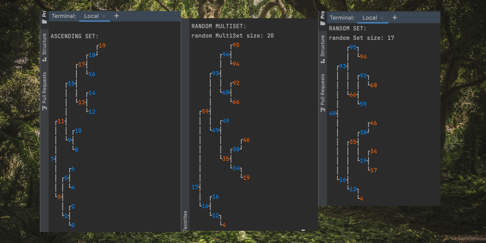
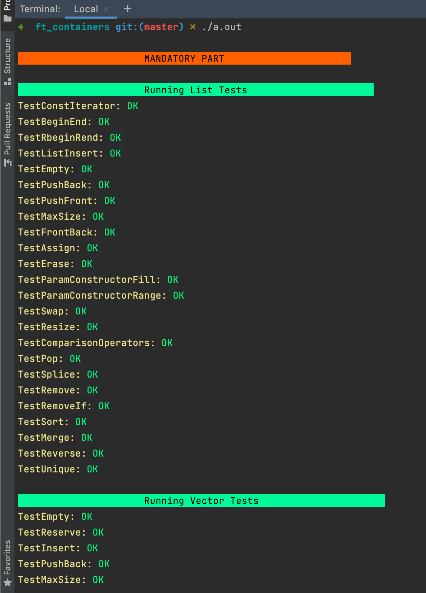
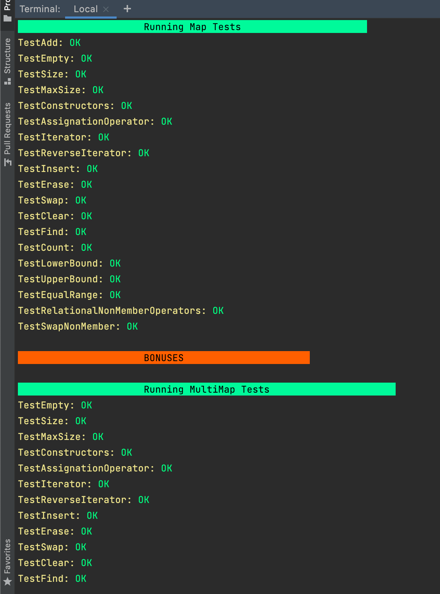
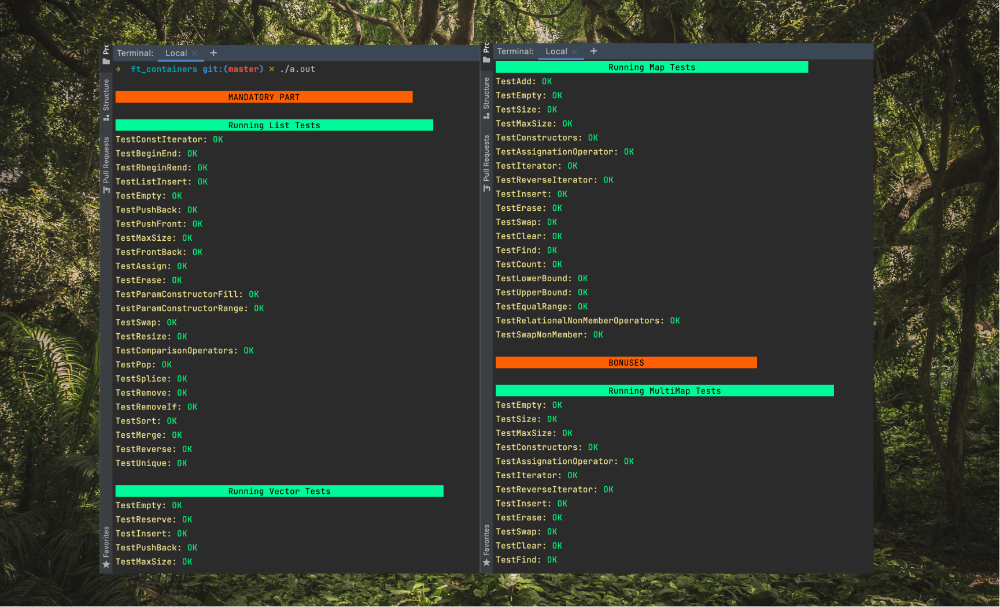

# C++ STL Containers implementation
c++98 standard


## 👋🏻 Story
This is a school 21 (Ecole 42) student project.  
The goal was to implement some of C++ STL containers. Using C++98 standard and this reference: [cplusplus.com/reference/stl](http://cplusplus.com/reference/stl/)    

### ✅ What I implemented:
```
Vector  
List  
Queue  
Stack  
Map  
MultiMap  
Set  
MultiSet  
```

### 🌳 I also coded this pretty tree print  

`Set` and `MultiSet` act differently with the same input  


### 🧪 Unit Testing

[comment]: <> ()

[comment]: <> ()


## 🏁 Ready set go
Test that all containers are built using c++98 standard features  
This works right only on linux systems, you can not even try this on mac  
```
g++ main.cpp -D TEST_STD98=1 -std=c++98 -pedantic
```

Run all tests
```
// on linux
g++ *.cpp

// on macos
g++ *.cpp -std=c++11
```

Print some pretty integer trees  
```
g++ *.cpp -D PRINT_INT_TREE=1 -std=c++11
```

## Credits
Author: Roman Kukin (mkristie)
Adviser: salec
Cover image: Photo by veeterzy from Pexels
